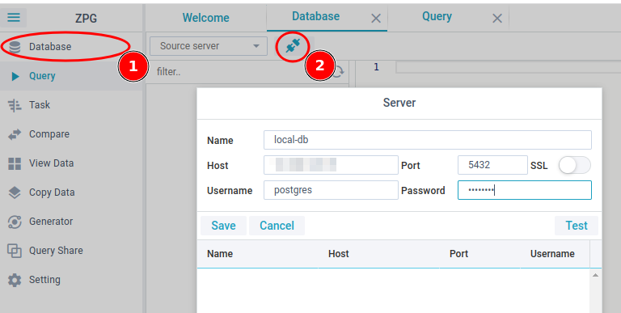
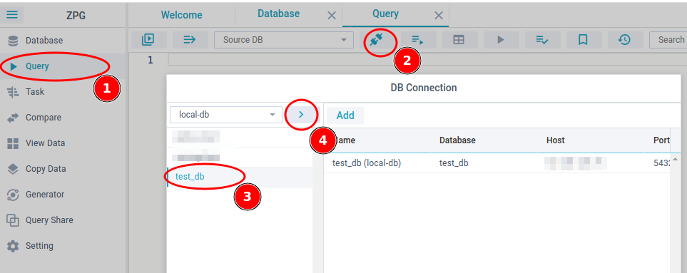
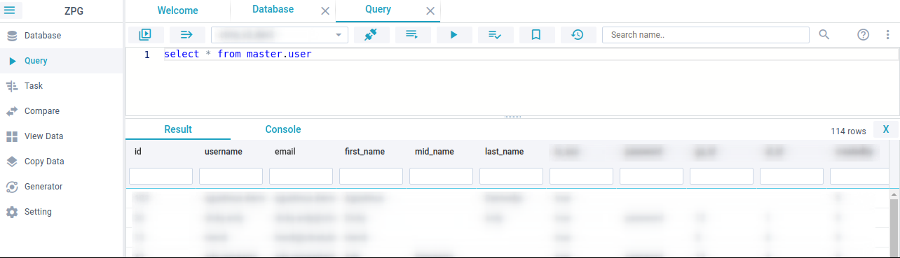

# ZPG

### Simple Postgres Editor

If you are mostly working with Postgres database programming, this tool for you.

**ZPG** an experimental side project written with [NodeJS](https://nodejs.org) and [Webix](https://webix.com) ([GPL license](https://www.npmjs.com/package/webix)), inspired by Jenkins and PgAdmin add some features to make it simple and easy.
For more other functionality of Postgres please use PgAdmin

Features idea:

- Easy to navigate
- Task SQL continues integration
- Comparing between SQL function direct correction
- Simple query editor
- Copy content between database
- Easy view table content
- Generator
- and more..

### Documentation

Docs [here](https://finzaiko.github.io/zpg) (currently on progress)

Try to [Quick Start](#quick_start)

### Requirement

- Node
- Postgres version 9.6 or above


### Install

Download [here](https://github.com/finzaiko/zpg/releases/tag/0.0.18-dev) and install

#### Ubuntu/Debian
```shell
wget https://github.com/finzaiko/zpg/releases/download/0.0.18-dev/zpg_0.0.18-dev_amd64.deb
sudo dpkg -i zpg_0.0.18-dev_amd64.deb
```

#### Fedora/RHEL
```shell
wget https://github.com/finzaiko/zpg/releases/download/0.0.18-dev/zpg-0.0.18-dev.x86_64.rpm
sudo yum localinstall zpg-0.0.18-dev.x86_64.rpm
or
sudo rpm -i zpg-0.0.18-dev.x86_64.rpm
```

#### AppImage Linux
```shell
wget https://github.com/finzaiko/zpg/releases/download/0.0.18-dev/ZPG-0.0.18-dev.AppImage
chmod a+x ZPG-0.0.18-dev.AppImage
./ZPG-0.0.18-dev.AppImage
```

#### AppImage Windows
```shell
Download and double click
```

#### Docker
```
docker run --rm --name zpg -p 9001:9000 -d -e "API_SERVER=http://localhost:9001" finzaiko/zpg:1.0
```
open in browser: http://localhost:9001

### Manual Development Install

```
git clone https://github.com/finzaiko/zpg.git
```

```
make install
```
Manual npm install
```
npm install
cd backend && npm install
cd frontend && npm install
```

#### Change ENV config

```
cd backend && cp .env.example .env
```

#### Run

```
npm run dev
```
or
```
make start-dev-server
```

or try desktop

```
make start-dev-desktop
```

#### Open

```
http://localhost:8000
```

##### Login

```
username: admin
password: admin123
```


### <span id="quick_start">Quick Start<span>

1. Create Server connection


2. Add DB Connection



### WARNING !

This is an experiment personal project, found some bug and under development, you can submit the issue.

#### One Screenshot

Query




#### Deploy PM2

```
# Increase JS heap momory to 4GB
pm2 start zpg/backend/index.js --node-args="--max-old-space-size=4096" --name "zpg"
pm2 save
pm2 startup
<Copy paste script result and run again>

```

### Other Apps

Try ZPG for mobile (Android) :point_right: [ZPG Postgres](https://play.google.com/store/apps/details?id=com.finzaiko.zpgm)
