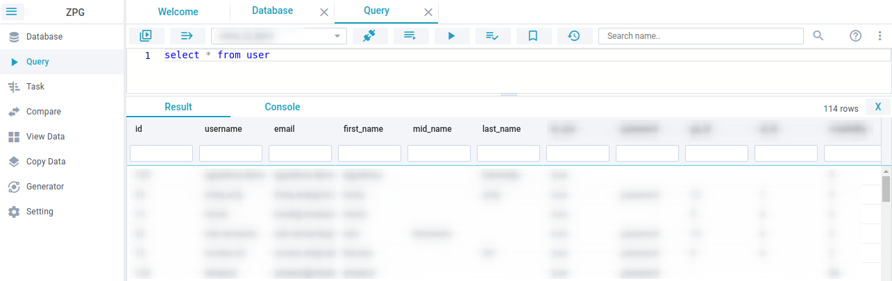

# ZPG

### Simple Postgres Editor

**ZPG** an experimental side project written with [NodeJS](https://nodejs.org) and [Webix](https://webix.com) ([GPL license](https://www.npmjs.com/package/webix)), inspired by Jenkins and PgAdmin add some features to make it simple and easy.  
For more other functionality of Postgres please use PgAdmin

Features idea:

- Easy to navigate
- Task SQL continues integration
- Comparing between SQL function direct correction
- Simple query editor
- Copy content between database (under development)
- Easy view table content
- Generator
- and more..

### WARNING !

This is an experiment personal project, many bug and under development.

### Requirement

- Node
- Postgres version 9.6 or above

### Install

```
git clone `https://github.com/finzaiko/zpg.git`

npm i && npm run postinstall
```

#### Run

```
npm run dev
```

#### Open

```
http://localhost:8000
```

##### Login

```
username: user1
password: user123#
```

#### Some Screenshot

Query



Developed by: Finzaiko
